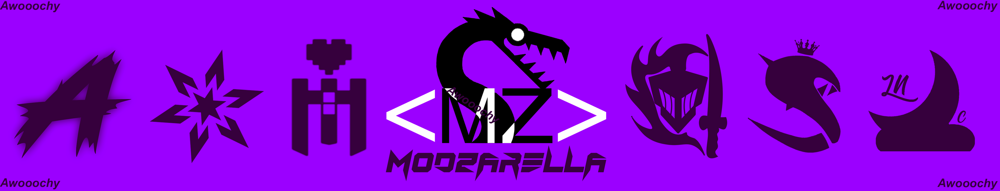

<body>
<h1 align="center"> ▁ ▂ ▄ ▅ ▆ ▇ █ 𝙒𝙀𝙇𝘾𝙊𝙈𝙀 𝙏𝙊 𝙈𝙔 𝙂𝙄𝙏𝙃𝙐𝘽 █ ▇ ▆ ▅ ▄ ▂ ▁ </h1>
<h1 align="center">      ▁ ▂ ▄ ▅ ▆ 𝙈𝙮 𝙣𝙖𝙢𝙚 𝙞𝙨 𝘼𝙬𝙤𝙤𝙤𝙘𝙝𝙮 ▆ ▅ ▄ ▂ ▁ </h1>
 

 

<b>(っ◔◡◔)っ ♥ _____________________________________________________________________________________________________________________________________ ♥ </b>

<h2 align="center">𝙈𝙔 𝘽𝙄𝙊</h2>

<li>
<b>Name:</b> Awooochy>
<li>
<b>Where I am from?:</b> Catalunya
</li>
<li>
<b>Stuff I Love:</b> MyGF / MyDog / Anime / VRChat / VisualStudio / C# / Design / Games / Music
</li>
<li>
<b>Stuff I hate:</b> Politics / Drama / Skids lmao / Python / SPAM / TikTok 
</li>
<li>
<b>Gender:</b> Simply call me Awo
</li>
<li>
<b>Hobbys:</b> Cooking / Programming / Modding / CheatDev / DesignUI / Drawing
</li>
<li>
<b>Studies:</b> GraphicDesign / UnityGameDev / GameMakerDev / AssistedPrePrinting / Serigraphy
</li>
 
 
 

<b>(っ◔◡◔)っ ♥ _____________________________________________________________________________________________________________________________________ ♥ </b>

 
 

<h2 align="left">𝙄 𝙬𝙤𝙧𝙠 𝙬𝙞𝙩𝙝</h2>

<h2 align="left">𝙄 𝙠𝙣𝙤𝙬</h2>

<h2 align="left">𝙋𝙡𝙖𝙩𝙛𝙤𝙧𝙢𝙨 𝙄 𝙖𝙢 𝙞𝙣</h2>

 
 
 
 

<b>(っ◔◡◔)っ ♥ _____________________________________________________________________________________________________________________________________ ♥ </b>

<h2 align="center">𝘾𝙤𝙣𝙩𝙖𝙘𝙩</h2>
 

Social Media 

<h3 align="center">awooochy </h3>
 
<h3 align="center">Awooochy#3165 </h3>

 

 

</body>
